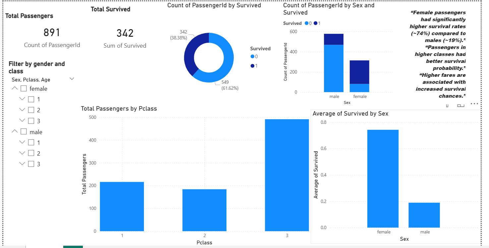

# 🚢 Titanic Survival Analysis & Dashboard

## 📌 Overview

This project analyzes the Titanic dataset to identify key factors influencing passenger survival using Python (EDA) and Power BI.

---

## 📊 Dashboard Preview

---

## 🎯 Objectives

* Analyze survival patterns based on gender, class, and fare
* Perform data cleaning and exploratory data analysis
* Build an interactive dashboard for insights

---

## 🛠 Tools & Technologies

* Python (Pandas, Matplotlib, Seaborn)
* Power BI
* Jupyter Notebook

---

## 🔍 Key Insights

* Female passengers had significantly higher survival rates (~74%) compared to males (~19%)
* First-class passengers had better survival probability
* Higher fares are associated with higher survival
* Socio-economic factors influenced survival outcomes

---

## 📂 Project Structure

Titanic-EDA-Dashboard/
│── data/
│── dashboard/
│── images/
│── eda.ipynb
│── README.md

---

## 🚀 Future Improvements

* Add machine learning model
* Deploy dashboard online
* Advanced feature engineering

---

## 💡 Author

Vikas M
